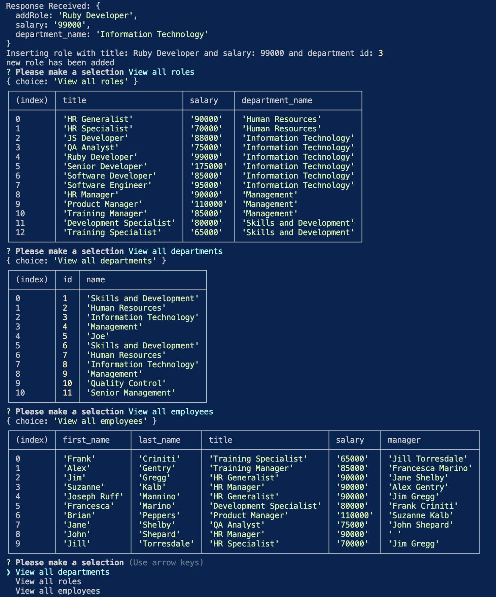

# Staff-Manager

## Description

This is a CLI app that will prompt employers to help them design their employee database. They are given the ability to view all: employees, roles, and departments. They can also add a new: employee, role, or department and they are given the ability through prompts to update an employee's role.

## Finished Product

## Usage

-  
- 

## License

## Video Link

<>

## GitHub Repo

<https://github.com/joegruff16/Staff-Manager>

## Credits

- Used this github to add usage markdown badges
  - **<https://github.com/Ileriayo/markdown-badges>**
- Added this license badge
  - **<https://gist.github.com/lukas-h/2a5d00690736b4c3a7ba>**
